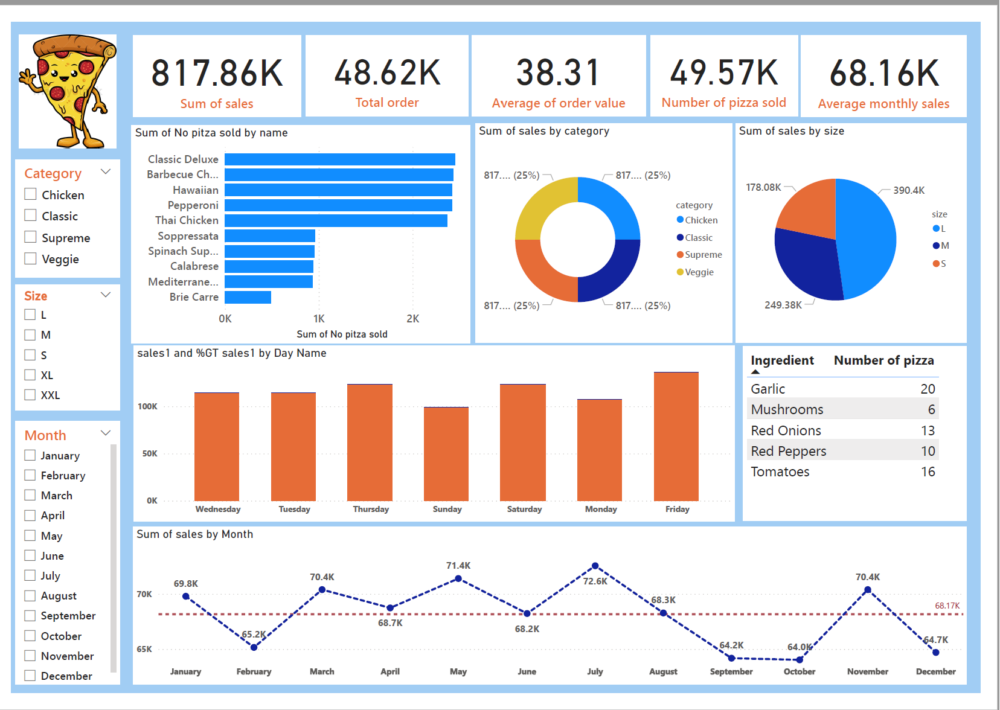

# 🍕 Pizza Sales Analysis & Visualization

A business intelligence project focused on analyzing pizza sales using **SQL** for data manipulation and **Power BI** for dashboard development. The goal was to uncover actionable insights to improve marketing strategies, optimize operations, and increase profitability.

---

## 📊 Tools Used

- **SQL** – Data exploration, joins, filtering, aggregation
- **Power BI** – Interactive dashboard creation and data storytelling
- **DAX** – Custom calculations and time-based metrics in Power BI

---

## 🗂️ Data Source

The dataset was obtained from **Maven Analytics**, and includes the following tables:

- `orders`
- `order_details`
- `pizzas`
- `pizza_types`

---

## 🧠 Methodology

- Cleaned and joined multiple tables using SQL
- Performed exploratory analysis to understand sales by category, date, and pizza size
- Built an interactive Power BI dashboard to visualize trends and highlight performance drivers
- Used DAX functions for further slicing and aggregating sales insights

📁 [View the SQL Code](https://github.com/ShariarN96/Pizza-sales-analysis/blob/main/pizza.sql)  
📊 

---

## 📌 Key Insights

- **Top Revenue-Generating Pizzas**:  
  The top 3 are all **chicken-based**:  
  - Thai Chicken  
  - Barbeque Chicken  
  - California Chicken  
  💰 Total revenue: **$127.61K**  
  ➤ Promotions targeting chicken pizzas could be highly effective.

- **Revenue by Pizza Category**:  
  - 🏆 Classic: $220.05K  
  - 🥈 Supreme: $208.20K  
  - 🥉 Chicken: $195.92K  
  - 🥬 Veggie: $193.69K

- **Preferred Pizza Size**:  
  - 🥇 Large > 🥈 Medium > 🥉 Small  
  ➤ Upselling larger sizes may drive higher revenue per order.

- **Sales by Day of the Week**:  
  - **Friday**
